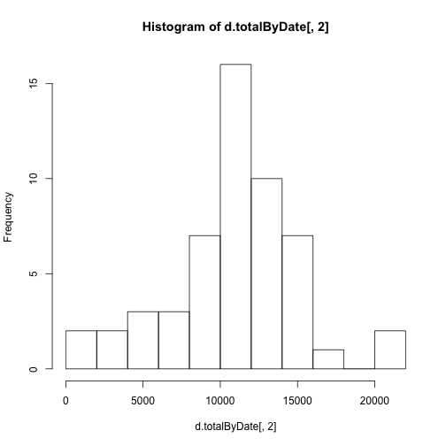
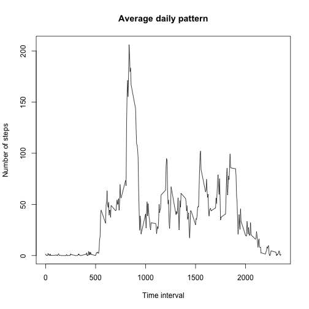
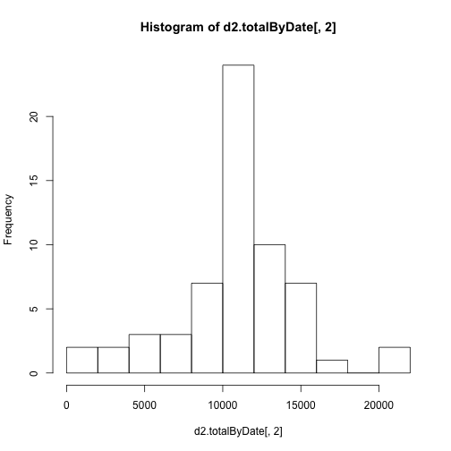
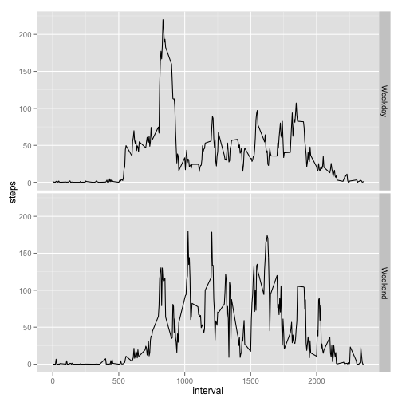

# Reproducible Research: Peer Assessment 1

## Loading and preprocessing the data

To start this data anysis study, the data set needs to be read from the CSV file and loaded into a data frame to work with, which is named *d*:


```r
d <- read.csv('./activity.csv')
```

The only pre-processing that is going to be applied to the resulting data frame consists in converting dates to the Date class understood by R:


```r
d$date <- as.Date(d$date)
```


## What is mean total number of steps taken per day?

The total number of steps taken per day is shown in the following histogram plot:


```r
d.totalByDate <- aggregate(d$steps,by=list(d$date),FUN=sum)
hist(d.totalByDate[,2],10)
```

 

```r
d.meanSteps <- mean(d.totalByDate[,2], na.rm=TRUE)
d.medianSteps <- median(d.totalByDate[,2], na.rm=TRUE)
```

Without considering NA values, the mean total steps taken per day is d.meanSteps = 1.0766 &times; 10<sup>4</sup>, and the median is d.medianSteps = 10765.


## What is the average daily activity pattern?

The average daily pattern considering the mean number of steps for each time interval throughout the day is shown in the following figure:


```r
d.dailyPattern <- aggregate(d$steps,by=list(d$interval),FUN=mean,na.rm=TRUE)
plot(d.dailyPattern,type='l',main='Average daily pattern',xlab='Time interval', ylab='Number of steps')
```

 

```r
d.maxActivityInterval <- d.dailyPattern[d.dailyPattern[,2]==max(d.dailyPattern[,2]),1]
```

The time interval with the maximum average number of steps is d.maxActivityInterval = 835, that is the 5-minutes interval at 8:35 am.

## Imputing missing values

The provided activity dataset does contain missing data coded as NA values. The total number of NA values is:


```r
sum(is.na(d))
```

```
## [1] 2304
```

The missing values are going to be filled in with the average number of steps for that time interval averaged across all days. To do so, the following code is used:


```r
d2 <- d
missing <- is.na(d$steps)

getFillValue <- function(x){
  d.dailyPattern[d.dailyPattern[,1]==x,2]
}

d2$steps[missing] <- sapply(d$interval[missing], getFillValue)
```

The number of NA values in the new *d2* data frame is assessed to be 0 after the filling process:


```r
sum(is.na(d2))
```

```
## [1] 0
```

The histogram of the total number of steps per day is plotted again for the new data frame with no NA values:


```r
d2.totalByDate <- aggregate(d2$steps,by=list(d2$date),FUN=sum)
hist(d2.totalByDate[,2],10)
```

 

And the mean and median for the new data frame are re-computed:


```r
mean(d2.totalByDate[,2])
```

```
## [1] 10766
```

```r
median(d2.totalByDate[,2]) 
```

```
## [1] 10766
```

The replacement of NA values by the mean number of steps for that time interval causes the dataset to contain more days for which the total number of steps per day correspond to the mean. Thus, since the replacement value is actually a mean value, the mean of the total number of steps per day has not been changed with respect to the original dataset with NA values. However, the median hs increased a little and now it is equal to the mean value.

## Are there differences in activity patterns between weekdays and weekends?

To be able to evaluate the difference between weekdakys and weekends, a new factor variable describing the day type is added to the data frame:


```r
d2$dayType <- weekdays(d2$date)
weekend <- (d2$dayType == 'Saturady') | (d2$dayType == 'Sunday')
d2$dayType[weekend] <- 'Weekend'
d2$dayType[!weekend] <- 'Weekday'
d2$dayType <- factor(d2$dayType)
```

Finally, the comparison between weekdays and weekends is shown in the following figure:


```r
library(ggplot2)
qplot(interval, steps, data=d2, facets=dayType~., stat='summary', fun.y=mean, geom='line')
```

 
